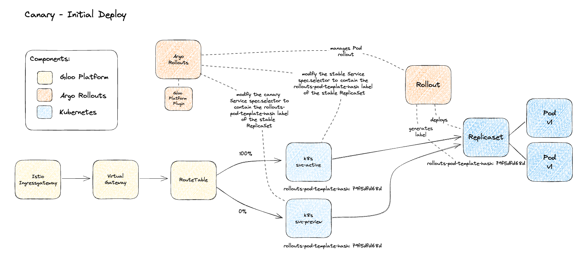
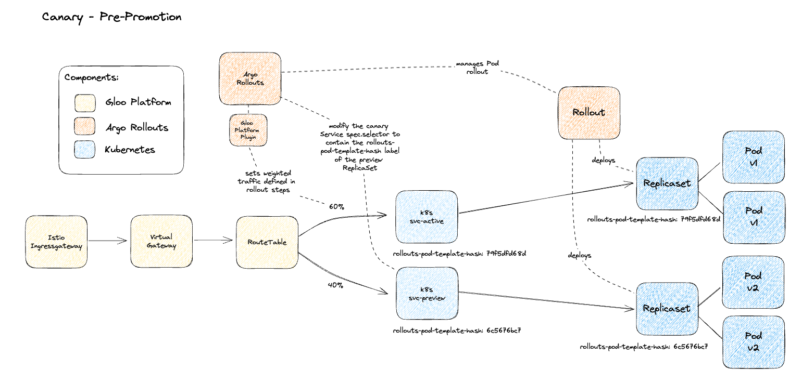
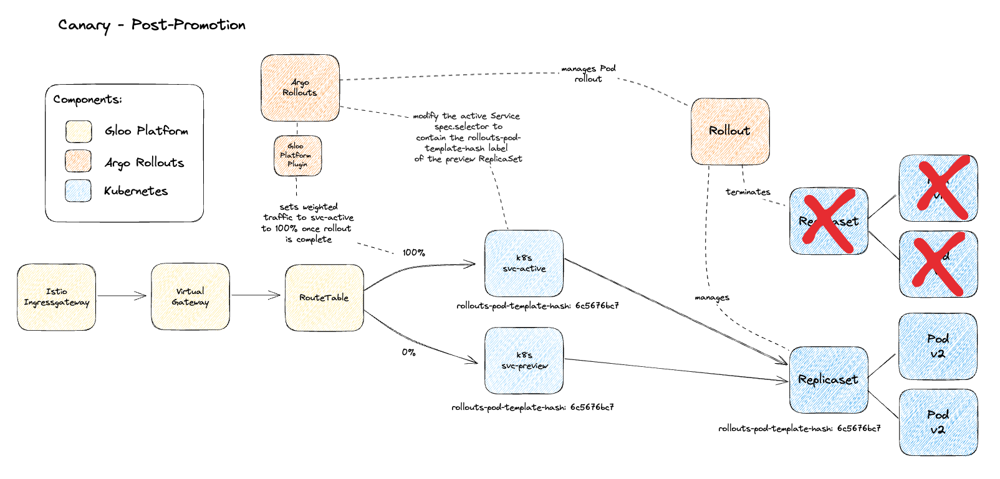
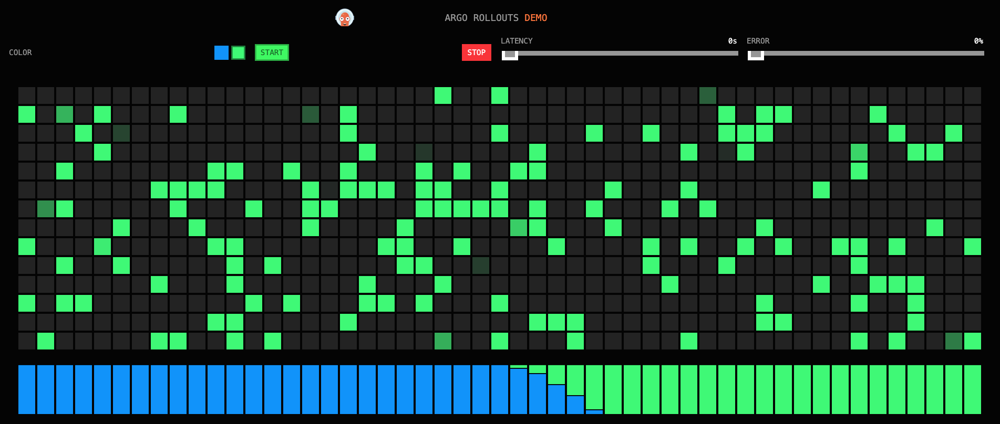
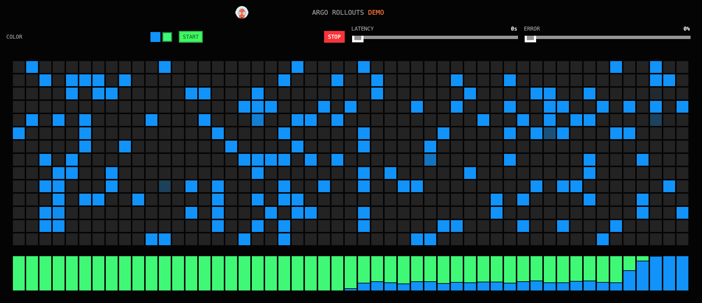
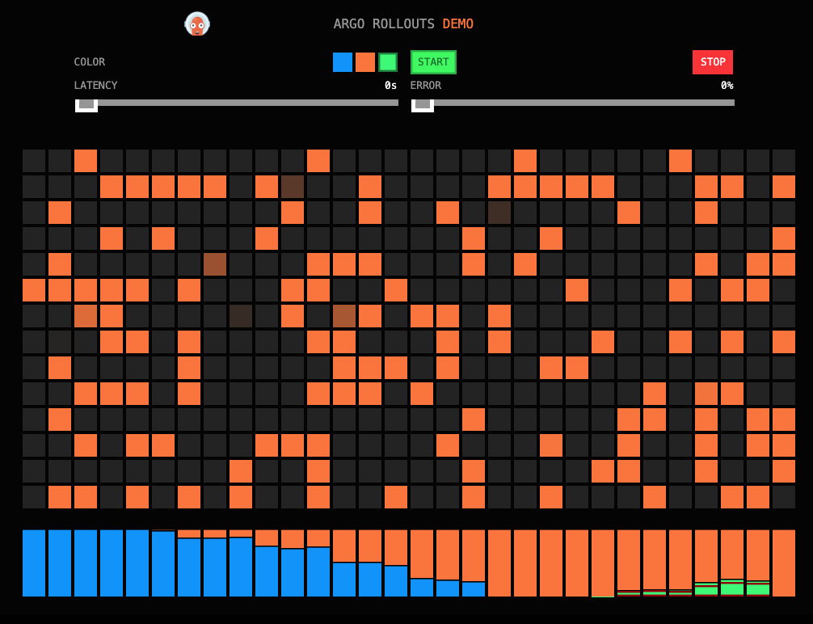

# Getting Started with Gloo Platform and Argo Rollouts

## Prerequisites
- K8s cluster deployed
- Gloo Platform installed and configured on a single cluster
- Istio deployed
  - This guide uses a revision based install method which uses the `istio.io/rev: 1-19` namespace label. If using the default istio injection label you can replace with `istio-injection: enabled` instead
  - This guide assumes that istiod is deployed in `istio-system` and the ingressgateway is deployed in `istio-gateways`
- VirtualGateway configured with the name `north-south-gw` in the `istio-gateways` namespace

# Gloo Platform Workspace Setup
Let's set up a simple catchall workspace for our rollouts demo
```
kubectl apply -f- <<EOF
apiVersion: admin.gloo.solo.io/v2
kind: Workspace
metadata:
  name: all
  namespace: gloo-mesh
spec:
  workloadClusters:
  - name: '*'
    namespaces:
    - name: '*'
---
apiVersion: admin.gloo.solo.io/v2
kind: WorkspaceSettings
metadata:
  name: all
  namespace: gloo-mesh
spec: {}
EOF
```

## Install the argo-rollouts controller
Install the kubectl argo-rollouts plugin as described [here](https://argoproj.github.io/argo-rollouts/installation/##kubectl-plugin-installation)

Instructions for brew
```
brew install argoproj/tap/kubectl-argo-rollouts
```

Create argo-rollouts namespace
```
kubectl create namespace argo-rollouts
```

Save the following as `kustomization.yaml`
```
cat > kustomization.yaml << EOF
apiVersion: kustomize.config.k8s.io/v1beta1
kind: Kustomization

namespace: argo-rollouts

resources:
- https://raw.githubusercontent.com/argoproj/argo-rollouts/v1.5.1/manifests/install.yaml

patchesJson6902:
  - target:
      kind: ClusterRole
      name: argo-rollouts
      version: v1
    patch: |
      - op: add
        path: /rules/-
        value:
          apiGroups:
          - networking.gloo.solo.io
          resources:
          - routetables
          verbs:
          - '*'
          
  - target:
      kind: ConfigMap
      name: argo-rollouts-config
      version: v1
    patch: |
      - op: add
        path: /data
        value:
          trafficRouterPlugins: |
            - name: "solo-io/glooplatform"
              location: "https://github.com/argoproj-labs/rollouts-plugin-trafficrouter-glooplatform/releases/download/v0.0.0-beta2/glooplatform-api-plugin-linux-amd64"
EOF
```

Now apply the kustomize using `kubectl apply -k` to deploy the argo-rollouts controller into the `argo-rollouts` namespace
```
kubectl apply -k .
```

Check to see if your argo-rollouts controller has been deployed:
```
% kubectl get pods -n argo-rollouts
NAME                             READY   STATUS    RESTARTS   AGE
argo-rollouts-758c6d9456-7phwn   1/1     Running   0          4m41s
```

You can see in the logs of the argo-rollouts pod that the `solo-io/glooedge` plugin was loaded in the output below
```
% kubectl logs -n argo-rollouts deploy/argo-rollouts
time="2023-10-31T17:41:08Z" level=info msg="Argo Rollouts starting" version=v1.2.0+423be7b
time="2023-10-31T17:41:08Z" level=info msg="Creating event broadcaster"
time="2023-10-31T17:41:08Z" level=info msg="Setting up event handlers"
time="2023-10-31T17:41:08Z" level=info msg="Setting up experiments event handlers"
time="2023-10-31T17:41:08Z" level=info msg="Setting up analysis event handlers"
time="2023-10-31T17:41:08Z" level=info msg="Downloading plugin solo-io/glooplatform from: https://github.com/argoproj-labs/rollouts-plugin-trafficrouter-glooplatform/releases/download/v0.0.0-beta2/glooplatform-api-plugin-linux-amd64"
time="2023-10-31T17:41:11Z" level=info msg="Download complete, it took 2.290603376s"
time="2023-10-31T17:41:11Z" level=info msg="Leaderelection get id argo-rollouts-758c6d9456-7phwn_65ac5f0a-f125-4f37-b32c-c5e2df674e3c"
time="2023-10-31T17:41:11Z" level=info msg="Starting Healthz Server at 0.0.0.0:8080"
time="2023-10-31T17:41:11Z" level=info msg="attempting to acquire leader lease argo-rollouts/argo-rollouts-controller-lock...\n"
time="2023-10-31T17:41:11Z" level=info msg="Starting Metric Server at 0.0.0.0:8090"
time="2023-10-31T17:41:11Z" level=info msg="successfully acquired lease argo-rollouts/argo-rollouts-controller-lock\n"
time="2023-10-31T17:41:11Z" level=info msg="New leader elected: argo-rollouts-758c6d9456-7phwn_65ac5f0a-f125-4f37-b32c-c5e2df674e3c"
time="2023-10-31T17:41:11Z" level=info msg="I am the new leader: argo-rollouts-758c6d9456-7phwn_65ac5f0a-f125-4f37-b32c-c5e2df674e3c"
time="2023-10-31T17:41:11Z" level=info msg="Starting Controllers"
time="2023-10-31T17:41:11Z" level=info msg="invalidated cache for resource in namespace: argo-rollouts with the name: argo-rollouts-notification-secret"
time="2023-10-31T17:41:11Z" level=info msg="Waiting for controller's informer caches to sync"
time="2023-10-31T17:41:11Z" level=info msg="Started controller"
time="2023-10-31T17:41:11Z" level=info msg="Starting Service workers"
time="2023-10-31T17:41:11Z" level=info msg="Starting Ingress workers"
time="2023-10-31T17:41:11Z" level=info msg="Starting analysis workers"
time="2023-10-31T17:41:11Z" level=info msg="Started Ingress workers"
time="2023-10-31T17:41:11Z" level=info msg="Started 30 analysis workers"
time="2023-10-31T17:41:11Z" level=info msg="Starting Experiment workers"
time="2023-10-31T17:41:11Z" level=info msg="Started Experiment workers"
time="2023-10-31T17:41:11Z" level=info msg="Started Service workers"
time="2023-10-31T17:41:11Z" level=info msg="Starting Rollout workers"
time="2023-10-31T17:41:11Z" level=warning msg="Controller is running."
time="2023-10-31T17:41:11Z" level=info msg="Started rollout workers"
time="2023-10-31T17:41:11Z" level=info msg="Istio detected"
time="2023-10-31T17:41:11Z" level=info msg="Starting istio workers"
time="2023-10-31T17:41:11Z" level=info msg="Istio workers (10) started"
```

## Canary Rollout Strategy
A Canary rollout is a deployment strategy where the operator releases a new version of their application to a small percentage of the production traffic. We can use weights, pause durations, and manual promotion in order to control how our application is rolled out across the stable and canary services

The Argo Rollouts Canary strategy supports the K8s API directly [basic example here](https://argo-rollouts.readthedocs.io/en/stable/features/canary/#example), as well as many examples of integrations for [Traffic Management](https://argo-rollouts.readthedocs.io/en/stable/features/traffic-management/) that allow more advanced rollout scenarios.

The example below uses the Canary strategy, implemented by the Gloo Platform Argo Rollouts Plugin. This plugin allows Argo Rollouts to manage Gloo Platform objects such as `RouteTable` and `Routes`.

In the `Rollout` config, we will configure the plugin integration with Gloo Platform by defining a `trafficRouting.plugin.solo-io/glooplatform`. The below example uses label selection for the `routeTableSelector` and `routeSelector`
```
trafficRouting:
  plugins:
    solo-io/glooplatform:
      routeTableSelector:
        labels:
          app: rollouts-demo
        namespace: rollouts-demo
      routeSelector:
        labels:
          route: rollouts-demo
```

It is also useful to note that it is possible to use static references instead of label selection as well
```
trafficRouting:
  plugins:
    solo-io/glooplatform:
      routeTableSelector:
        # can also support direct reference 
        name: rollouts-demo-routetable
        namespace: rollouts-demo
      routeSelector:
        # can also support direct reference  
        name: rollouts-demo
```

### Canary Rollout Diagram






First we will create the `rollouts-demo` namespace
```
kubectl apply -f- <<EOF
apiVersion: v1
kind: Namespace
metadata:
  name: rollouts-demo
  labels:
    istio.io/rev: 1-19
EOF
```

Next, we can deploy the v1 of our rollouts demo which uses the `blue` image tag
```
kubectl apply -f- <<EOF
apiVersion: v1
kind: ServiceAccount
metadata:
  name: rollouts-demo
  namespace: rollouts-demo
---
apiVersion: v1
kind: Service
metadata:
  name: rollouts-demo-active
  namespace: rollouts-demo
  labels:
    app: rollouts-demo
    service: rollouts-demo
spec:
  ports:
  - name: http
    port: 8080
    targetPort: 8080
  selector:
    app: rollouts-demo
---
apiVersion: v1
kind: Service
metadata:
  name: rollouts-demo-preview
  namespace: rollouts-demo
  labels:
    app: rollouts-demo
    service: rollouts-demo
spec:
  ports:
  - name: http
    port: 8080
    targetPort: 8080
  selector:
    app: rollouts-demo
---
apiVersion: argoproj.io/v1alpha1
kind: Rollout
metadata:
  name: rollouts-demo
  namespace: rollouts-demo
spec:
  revisionHistoryLimit: 2
  selector:
    matchLabels:
      app: rollouts-demo
  strategy:
    canary:
      canaryService: rollouts-demo-preview
      stableService: rollouts-demo-active
      trafficRouting:
        plugins:
          solo-io/glooplatform:
            routeTableSelector:
              labels:
                app: rollouts-demo
              namespace: rollouts-demo
            routeSelector:
              labels:
                route: rollouts-demo
      steps:
      - setWeight: 10
      - pause: {duration: 5}
      - setWeight: 25
      - pause: {duration: 5}
      - setWeight: 50
      - pause: {duration: 5}
      - setWeight: 75
      - pause: {duration: 5}
      - setWeight: 100
      - pause: {duration: 5}
  template:
    metadata:
      labels:
        app: rollouts-demo
        version: stable
      annotations:
        proxy.istio.io/config: '{ "holdApplicationUntilProxyStarts": true }'
    spec:
      containers:
      - name: rollouts-demo
        image: argoproj/rollouts-demo:blue
        imagePullPolicy: IfNotPresent
        ports:
        - name: http
          containerPort: 8080
          protocol: TCP
        resources:
          requests:
            cpu: 5m
            memory: 32Mi
EOF
```

Check your rollout status:
```
kubectl argo rollouts get rollout rollouts-demo -n rollouts-demo
```

Output should look similar to below:
```
% kubectl argo rollouts get rollout rollouts-demo -n rollouts-demo
Name:            rollouts-demo
Namespace:       rollouts-demo
Status:          ✔ Healthy
Strategy:        Canary
  Step:          10/10
  SetWeight:     100
  ActualWeight:  100
Images:          argoproj/rollouts-demo:blue (stable)
Replicas:
  Desired:       1
  Current:       1
  Updated:       1
  Ready:         1
  Available:     1

NAME                                      KIND        STATUS     AGE  INFO
⟳ rollouts-demo                           Rollout     ✔ Healthy  95s  
└──# revision:1                                                       
   └──⧉ rollouts-demo-858974c74           ReplicaSet  ✔ Healthy  95s  stable
      └──□ rollouts-demo-858974c74-hkhgn  Pod         ✔ Running  13s  ready:2/2
```

Next we can expose our rollout deployment through the ingress gateway
```
kubectl apply -f- <<EOF
apiVersion: networking.gloo.solo.io/v2
kind: RouteTable
metadata:
  name: rollouts-demo-routetable
  namespace: rollouts-demo
  labels:
    app: rollouts-demo
spec:
  hosts:
    - '*'
  virtualGateways:
    - name: north-south-gw
      namespace: istio-gateways
      cluster: mgmt
  http:
    - name: rollouts-demo
      matchers:
      - uri:
          prefix: /
      labels:
        route: rollouts-demo
      forwardTo:
        destinations:
        - ref:
            name: rollouts-demo-active
            namespace: rollouts-demo
            cluster: mgmt
          port:
            number: 8080
          subset: 
            version: stable
          weight: 100	
        - ref:	
            name: rollouts-demo-preview	
            namespace: rollouts-demo
          port:	
            number: 8080
EOF
```

You should now be able to access the application in the browser using the following command output
```
echo "access the rollouts demo UI at https://$(kubectl -n istio-gateways get service istio-ingressgateway-1-19 -o jsonpath='{.status.loadBalancer.ingress[0].*}')"
```

Now lets promote the image from the `blue` image tag to the `green` image tag and watch the traffic pattern in the UI
```
kubectl argo rollouts set image rollouts-demo -n rollouts-demo rollouts-demo=argoproj/rollouts-demo:green
```

Compared to a typical blue/green rollout strategy which immediately switches over, here we should see a more gradual shift in traffic as defined in our rollout strategy
```
steps:
- setWeight: 10
- pause: {duration: 5}
- setWeight: 25
- pause: {duration: 5}
- setWeight: 50
- pause: {duration: 5}
- setWeight: 75
- pause: {duration: 5}
- setWeight: 100
- pause: {duration: 5}
```

In the rollouts demo UI we should be able to see the steps and the respective weights pretty clearly in the shift from blue to green.


## Bonus:
If you set the Rollout strategy steps as follows, the promotion will happen automatically every 5 seconds except for the second step (at 25%) which requires a manual promotion
```
steps:
- setWeight: 10
- pause: {duration: 5}
- setWeight: 25
- pause: {}
- setWeight: 50
- pause: {duration: 5}
- setWeight: 75
- pause: {duration: 5}
- setWeight: 100
- pause: {duration: 5}
```

When doing so, you can also run a `-w` watch command on the following resources to visualize the config changes being managed by the Rollouts controller which are described in the diagrams at the top of this section
```
kubectl get svc rollouts-demo-active -n rollouts-demo -oyaml -w
kubectl get svc rollouts-demo-preview -n rollouts-demo -oyaml -w
kubectl get routetable rollouts-demo-routetable -n rollouts-demo -oyaml -w
```

Run the following command to promote the rollout:
```
kubectl argo rollouts promote rollouts-demo -n rollouts-demo
```

In the rollouts demo UI we should be able to see that the rollout pauses at the 25% weight until promoted, with the rest of the rollout automatically promoted after a 5 second duration between steps.


## Analysis Runs
As a part of the `Rollout`, analysis can be run in the background -- while the canary is progressing through its rollout steps.

An AnalysisTemplate is a template spec which defines how to perform a canary analysis, such as the metrics which it should perform, its frequency, and the values which are considered successful or failed. AnalysisTemplates may be parameterized with inputs values.


Here is a very simple `AnalysisTemplate` which is meant to always succeed
```
kubectl apply -f- <<EOF
# This AnalysisTemplate will run a Kubernetes Job every 5 seconds that succeeds.
kind: AnalysisTemplate
apiVersion: argoproj.io/v1alpha1
metadata:
  name: pass
  namespace: rollouts-demo
spec:
  metrics:
  - name: pass
    count: 1
    interval: 5s
    failureLimit: 1
    provider:
      job:
        spec:
          template:
            spec:
              containers:
              - name: sleep
                image: alpine:3.8
                command: [sh, -c]
                args: [exit 0]
              restartPolicy: Never
          backoffLimit: 0
EOF
```

Now we can add an `strategy.canary.steps.analysis` config to our `Rollout`
```
kubectl apply -f- <<EOF
apiVersion: argoproj.io/v1alpha1
kind: Rollout
metadata:
  name: rollouts-demo
  namespace: rollouts-demo
spec:
  revisionHistoryLimit: 2
  selector:
    matchLabels:
      app: rollouts-demo
  strategy:
    canary:
      canaryService: rollouts-demo-preview
      stableService: rollouts-demo-active
      trafficRouting:
        plugins:
          solo-io/glooplatform:
            routeTableSelector:
              labels:
                app: rollouts-demo
              namespace: rollouts-demo
            routeSelector:
              labels:
                route: rollouts-demo
      steps:
      - setWeight: 10
      - pause: {duration: 5}
      - setWeight: 25
      - pause: {duration: 5}
      - setWeight: 50
      - pause: {duration: 5}
      - setWeight: 75
      - pause: {duration: 5}
      - setWeight: 100
      - pause: {duration: 5}
      analysis:
        templates:
        - templateName: pass
        startingStep: 1
  template:
    metadata:
      labels:
        app: rollouts-demo
        version: stable
      annotations:
        proxy.istio.io/config: '{ "holdApplicationUntilProxyStarts": true }'
    spec:
      containers:
      - name: rollouts-demo
        image: argoproj/rollouts-demo:blue
        imagePullPolicy: IfNotPresent
        ports:
        - name: http
          containerPort: 8080
          protocol: TCP
        resources:
          requests:
            cpu: 5m
            memory: 32Mi
EOF
```

Since we are adding the `analysis` but also in the process changing the image back to `argoproj/rollouts-demo:blue` a new rollout will kick off

If you check the rollout status again, this time we will see the added `AnalysisRun` step shows that it was `✔ Successful` which means that during the rollout the analysis was triggered and passed
```
kubectl argo rollouts get rollout rollouts-demo -n rollouts-demo
```

## Integrating with Istio Observability
With Istio integration, we can experiment with much more advanced `AnalysisTemplate` options such as leveraging Prometheus queries and Istio metrics to set a success condition for promotion
```
kubectl apply -f- <<EOF
apiVersion: argoproj.io/v1alpha1
kind: AnalysisTemplate
metadata:
  name: istio-success-rate
  namespace: rollouts-demo
spec:
  args:
  - name: service
  - name: namespace
  metrics:
  - initialDelay: 15s
    interval: 15s
    name: success-rate
    provider:
      prometheus:
        address: http://prometheus.istio-system:9090
        query: >+
          sum(irate(istio_requests_total{
            reporter="source",
            destination_service=~"{{args.service}}.{{args.namespace}}.svc.cluster.local",
            response_code!~"2.*"}[30s])
          )
          /
          sum(irate(istio_requests_total{
            reporter="source",
            destination_service=~"{{args.service}}.{{args.namespace}}.svc.cluster.local"}[30s])
          )
    successCondition: len(result) == 0 || result[0] < 0.05
EOF
```

Now we can update the `strategy.canary.steps.analysis` config to our `Rollout` to use this new `AnalysisTemplate`
```
kubectl apply -f- <<EOF
apiVersion: argoproj.io/v1alpha1
kind: Rollout
metadata:
  name: rollouts-demo
  namespace: rollouts-demo
spec:
  revisionHistoryLimit: 2
  selector:
    matchLabels:
      app: rollouts-demo
  strategy:
    canary:
      canaryService: rollouts-demo-preview
      stableService: rollouts-demo-active
      trafficRouting:
        plugins:
          solo-io/glooplatform:
            routeTableSelector:
              labels:
                app: rollouts-demo
              namespace: rollouts-demo
            routeSelector:
              labels:
                route: rollouts-demo
      steps:
      - setWeight: 10
      - pause: {duration: 15}
      - setWeight: 25
      - pause: {duration: 15}
      - setWeight: 50
      - pause: {duration: 15}
      - setWeight: 100
      - pause: {duration: 15}
      analysis:
        args:
        - name: service
          value: rollouts-demo-preview
        - name: namespace
          valueFrom:
            fieldRef:
              fieldPath: metadata.namespace
        startingStep: 1
        templates:
        - templateName: istio-success-rate
  template:
    metadata:
      labels:
        app: rollouts-demo
        version: stable
      annotations:
        proxy.istio.io/config: '{ "holdApplicationUntilProxyStarts": true }'
    spec:
      containers:
      - name: rollouts-demo
        image: argoproj/rollouts-demo:blue
        imagePullPolicy: IfNotPresent
        ports:
        - name: http
          containerPort: 8080
          protocol: TCP
        resources:
          requests:
            cpu: 5m
            memory: 32Mi
EOF
```

Since we modified our analysis config, but did not change the image tag, there should not be a rollout that kicks off automatically. Let's repeat the experiment and change the image again to another color
```
kubectl argo rollouts set image rollouts-demo -n rollouts-demo rollouts-demo=argoproj/rollouts-demo:orange
```

If you check the rollout status again, this time we will see the added `AnalysisRun` step shows that it was `✔ Successful` which means that during the rollout the analysis was triggered and passed
```
kubectl argo rollouts get rollout rollouts-demo -n rollouts-demo -w
```

You can even see the output of the AnalysisRun
```
kubectl get analysisrun -n rollouts-demo
```

You can even describe a selected AnalysisRun to see more details
```
kubectl describe analysisrun -n rollouts-demo rollouts-demo-5bc478cfbd-8
```

## Failed AnalysisRun and Automatic Rollback
Now let's repeat the experiment and change the image again, except this time to a known bad image tag `bad-green`
```
kubectl argo rollouts set image rollouts-demo -n rollouts-demo rollouts-demo=argoproj/rollouts-demo:bad-green
```

This time we should see that green boxes with red outlines start showing up in our rollouts demo UI. This bad rollout is captured quickly by our `AnalysisRun` and rolled back to the last known stable state
```
% kubectl get analysisrun -n rollouts-demo
NAME                         STATUS       AGE
rollouts-demo-77c77bf74d-2   Successful   3m8s
rollouts-demo-789db855f9-3   Failed       93s
```

In the image below you can see the successful rollout from `blue` to `orange`, as well as the rollout to `bad-green` and rollback to `orange`


## Cleanup Canary rollouts demo
```
kubectl delete serviceaccount rollouts-demo -n rollouts-demo
kubectl delete service rollouts-demo-preview -n rollouts-demo
kubectl delete service rollouts-demo-active -n rollouts-demo
kubectl delete rollout rollouts-demo -n rollouts-demo
kubectl delete analysistemplate pass -n rollouts-demo
kubectl delete analysistemplate istio-success-rate -n rollouts-demo
kubectl delete routetable rollouts-demo-routetable -n rollouts-demo
kubectl delete workspacesettings all -n gloo-mesh
kubectl delete workspace all -n gloo-mesh
```

## Conclusion
This tutorial demonstrates the ease of integrating progressive delivery workflows to your application deployments using Argo Rollouts and Gloo Platform but only scratches the surface! Many standard options exist in the Argo Rollouts Documentation such as [BlueGreen Deployment Strategy](https://argo-rollouts.readthedocs.io/en/stable/features/bluegreen/) and [Canary Strategy](https://argo-rollouts.readthedocs.io/en/stable/features/canary/). Take a look at other strategies and routing examples in the plugin [github repo examples](https://github.com/argoproj-labs/rollouts-plugin-trafficrouter-glooedge/tree/main/examples) as well as the [Analysis & Progressive Delivery](https://argo-rollouts.readthedocs.io/en/stable/features/analysis/) documentation for more ways to get started!